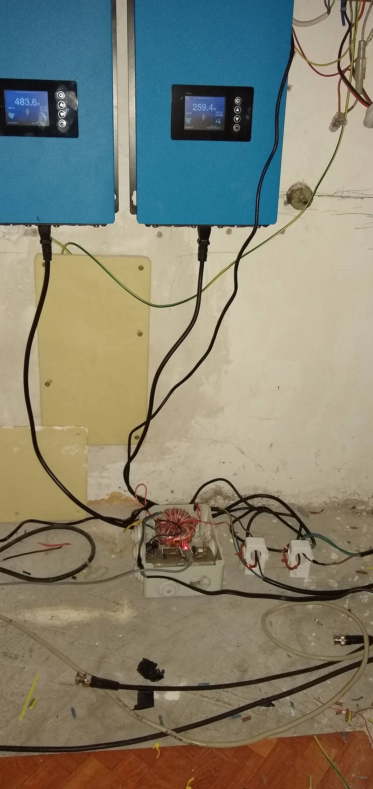
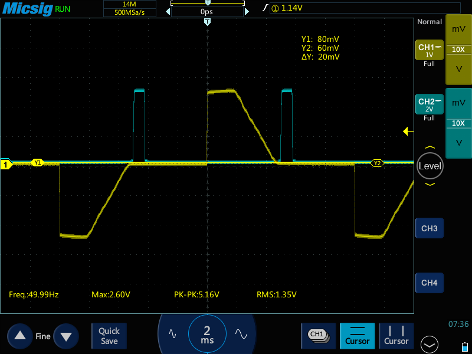

# gtil-power-control
non-invasive control of gtil inverter power

simply put the coil inside the current transformer. 

To control two or more gtil simply wire  the coils in series, the power will be the same for all the gtil.

Schematic diagram, arduino code and python code included in repository

